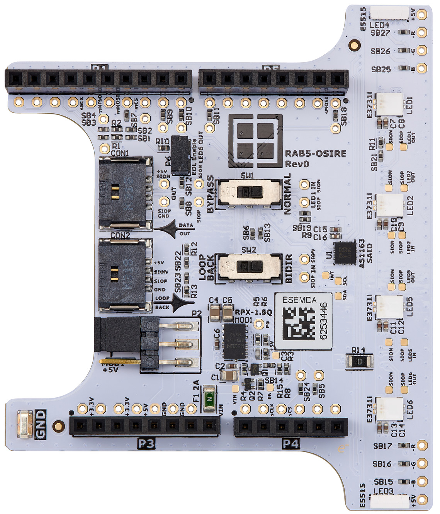

# RAB5-OSIRE Hardware Design Files

The RAB5-OSIRE is an evaluation board featuring the ams OSRAM OSIRE® E3731i and OSIRE® E5515 LEDs with a ams OSRAM AS1163 Stand-alone intelligent driver. The on-board RPX-1.5Q 1.5A 5V can provide more power for the external LED stripes.

Here you may find hardware documents as follows:

- Schematics, PCB layout, and mechanical drawings
- BOM: Bill of Materials
- Assembly drawings
- Rev0 [prototype] hardware files
- Altium Designer Project
- Gerber Files

## Legal Disclaimer

The evaluation board including the software is for testing purposes only and, because it has limited functions and limited resilience, is not suitable for permanent use under real conditions. If the evaluation board is nevertheless used under real conditions, this is done at one’s responsibility; any liability of Rutronik is insofar excluded. 

